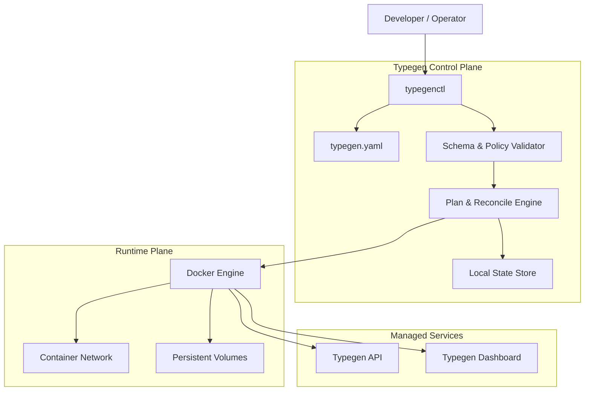
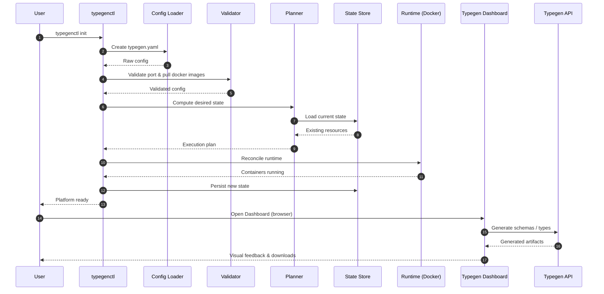

# Typegen CLI

<p align="center">
  
</p>

<p align="center">
  <strong>System controller for the Typegen ecosystem</strong><br/>
  Deterministic • Safe • Production‑ready
</p>

<p align="center">
  
  
  
  
</p>

---

### **Typegen CLI**

**TypegenCLI** (`typegenctl`) is the control plane of the Typegen platform. It is a statically compiled, single-binary
CLI written in Go that orchestrates the lifecycle of Typegen services (Server and UI) using Docker.

It provides deterministic lifecycle management, configuration validation, runtime status inspection, and safe execution
of operational workflows for both local development and production environments.

The Typegen platform is composed of **three first‑class components**, each with a clear and isolated responsibility:

### 1. Typegen CLI

The control plane of the platform.

* Statically compiled, single‑binary CLI
* Orchestrates the full Typegen system lifecycle
* Validates configuration and runtime safety
* Acts as the **only required entry point** for operators and developers

### 2. Typegen Server

The core execution engine.

* Processes schemas and contracts
* Generates language‑specific types
* Exposes deterministic APIs for automation
* Designed to be stateless and horizontally scalable

📖 **Documentation:** [Typegen Server README](https://github.com/khanalsaroj/typegen-server?tab=readme-ov-file)

### 3. Typegen UI

The user interface layer.

* Visual schema and project management
* Service status and health visibility
* Developer‑friendly workflows
* Connects exclusively through the Typegen API

📖 **Documentation:** [Typegen UI README](https://github.com/khanalsaroj/typegen-ui?tab=readme-ov-file)

---

## System Architecture

### 1. Control Flow



### 2. Data Flow



---

## ⚙️ Installation

```bash
# Via install script (requires curl)
curl -fsSL https://raw.githubusercontent.com/khanalsaroj/typegen-cli/refs/heads/main/main/install.sh | sh
```

Or download a prebuilt binary for your platform from the [Releases](https://github.com/sarojkhanal/typegen-cli/releases)
page.

---

## 🚀 Getting Started

```bash
typegenctl init                 # Generate default configuration (typegen.yaml)
typegenctl pull                 # Pull required Docker images
typegenctl run                  # Start the Typegen service stack
typegenctl status               # Check health and status of services
typegenctl dashboard            # Open the dashboard in your default browser
```

---

## 🔧 Configuration

The CLI uses a `typegen.yaml` file for configuration. By default, it looks for this file in the path specified during
`init` (defaulting to the local directory or internal path).

```yaml
services:
  frontend:
    image:
      name: ghcr.io/khanalsaroj/typegen-ui
      tag: latest
    container_name: Frontend
    port:
      host: 3000
      container: 3000
    enabled: true

  backend:
    image:
      name: ghcr.io/khanalsaroj/typegen-server
      tag: latest
    container_name: Backend
    port:
      host: 8080
      container: 8080
    enabled: true
```

---

### ▶️ Commands

| Command     | Description                                                          |
|:------------|:---------------------------------------------------------------------|
| `init`      | Bootstrap the environment and generate `typegen.yaml`.               |
| `check`     | Validate configuration, host prerequisites, and Docker availability. |
| `pull`      | Fetch and verify required Docker images.                             |
| `run`       | Start the Typegen services (creates and starts containers).          |
| `start`     | Start existing (but stopped) Typegen containers.                     |
| `stop`      | Gracefully stop running containers without removing them.            |
| `restart`   | Restart service containers.                                          |
| `status`    | Inspect and report the current runtime state.                        |
| `update`    | Pull the latest images for the services.                             |
| `cleanup`   | Remove obsolete Docker images and stopped containers.                |
| `dashboard` | Open the Typegen user interface (UI) in the browser.                 |

---

### ▶️ Global & Common Flags

Available for most commands:

| Flag                      | Description                                               |
|:--------------------------|:----------------------------------------------------------|
| `--config <path/to/file>` | Full path to the `typegen.yaml` file, including its name. |
| `--json`                  | Output results in JSON format.                            |
| `--dry-run`               | Show planned actions without executing them.              |
| `--version`, `-v`         | Print version information.                                |

**Service Selection Flags** (Available for `init`):

| Flag                      | Description                                                                                   |
|:--------------------------|:----------------------------------------------------------------------------------------------|
| `--frontend <port>`       | Set the frontend service port (default: 3000).                                                |
| `--backend <port>`        | Set the backend service port (default: 8080).                                                 |
| `--force`                 | Overwrite existing `typegen.yaml` if it exists.                                               |
| `--config <path/to/file>` | Full path to the `typegen.yaml` file, including its name file will be created or overwritten. |

**Service Selection Flags** (Available for `run`, `stop`, `start`, `restart`, `pull`, `status`, `update`, `cleanup`,
`check`):

| Flag         | Description                                 |
|:-------------|:--------------------------------------------|
| `--frontend` | Apply command to the frontend service only. |
| `--backend`  | Apply command to the backend service only.. |

---

### ♻️ Planned Enhancements

### 1. Platform & Language Support

* **Additional database connections**: Oracle, Microsoft SQL Server, SQLite, and MongoDB (NoSQL)
* **Additional target languages**: Kotlin, Python, C#, and Go

### 2. DTO / Type Generation

* Expanded customization options when generating DTOs and types
* Greater control over naming, structure, and type mapping
* Smarter defaults while allowing full user override

### 3. AI-Assisted Features

* Intelligent naming suggestions for models, fields, and types
* Context-aware type inference and recommendations powered by AI

### 4. CLI Improvements

* The CLI will support **custom file names and flexible directory structures**
* Instead of relying on a single default file name, the CLI will:

    * Discover and load **all configuration files with the `.typegen.yaml` extension**
    * Aggregate all defined servers from those files
    * Execute generation across **all detected services** in a single run

### 🔍 Contact

- **GitHub Issues:** [Report bugs and feature requests](https://github.com/sarojkhanal/typegenc-cli/issues)
- **Developer:** Khanal Saroj (waytosarojkhanal@gmail.com)

---

### Personal Note

> Typegen — boring by design, reliable by default.
>
> After four years of writing Java, I decided to step outside looking for something new. This project was
> built in Go, with zero prior experience and a healthy amount of confusion.
>
> Would I do it again? Probably.
>
> Thanks, Caffeine and LLMs. It is what it is.
